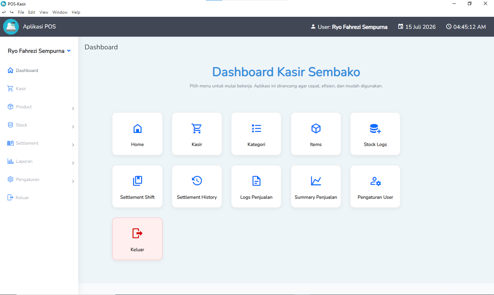
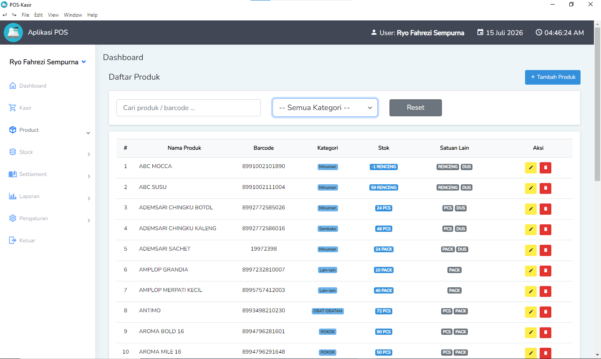
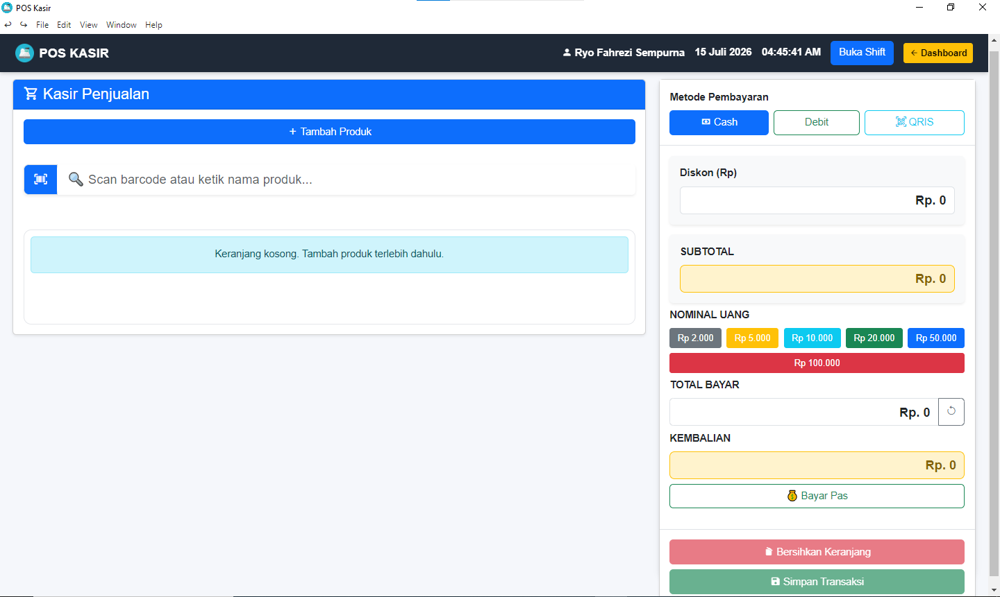
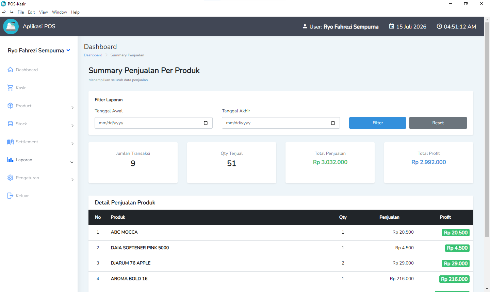
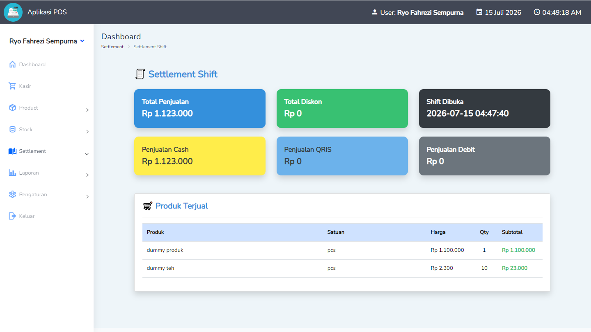

# 🛒 Kasir POS Sembako

A desktop-based Point of Sale (POS) application developed with **Laravel** for grocery stores. The system simplifies daily cashier operations, inventory management, sales reporting, and financial recording. The application is packaged as a **Windows desktop application** using **Electron**, providing a native desktop experience while automatically managing the Laravel backend.

---

## 📌 Project Overview

Kasir POS Sembako was developed to replace manual sales and inventory management processes commonly found in small and medium-sized grocery stores.

The application provides an integrated solution for product management, cashier transactions, inventory tracking, settlement management, financial reporting, and thermal receipt printing through a simple and user-friendly interface.

---

## ⭐ Key Features

- 🛒 Point of Sale (POS)
- 📦 Product & Category Management
- 📏 Multi Unit Product Support
- 💰 Average Purchase Cost (HPP) Calculation
- 📊 Sales & Revenue Reports
- 📒 Automatic General Journal
- 📦 Stock Movement History
- 👤 User Management
- 🖨️ ESC/POS Thermal Receipt Printing
- 💵 Cash Drawer Integration
- 🧾 Transaction Reprint
- 🔄 Cashier Settlement (Open & Close Shift)
- 💻 Windows Desktop Application
- 🌐 Offline Local Operation

---

# 🚀 Technology Stack

| Category | Technology |
|----------|------------|
| Backend | Laravel 10 |
| Programming Language | PHP 8.3 |
| Frontend | Blade, Bootstrap 5, JavaScript, jQuery |
| Database | MySQL |
| Desktop Runtime | Electron |
| Local Server | PHP Built-in Server (`php artisan serve`) |
| Receipt Printing | ESC/POS |
| Cash Drawer | ESC/POS LAN |
| Version Control | Git & GitHub |

---

# 🏗️ System Architecture

```text
                    User
                      │
                      ▼
          Windows Desktop Application
                  (Electron)
                      │
                      ▼
      Automatically Starts Laravel Server
             (php artisan serve)
                      │
                      ▼
           Laravel Web Application
                      │
          ┌───────────┴───────────┐
          ▼                       ▼
    MySQL Database         ESC/POS Printer
                                    │
                                    ▼
                              Cash Drawer
```

---

# ⚙️ How It Works

1. User launches the desktop application (`POS.exe`).
2. Electron automatically starts the Laravel local server (`php artisan serve`).
3. The application loads the Laravel interface inside an Electron window.
4. Users perform daily cashier operations normally.
5. Electron handles hardware communication such as receipt printing and cash drawer control.
6. When the application closes, Electron automatically stops the Laravel server.

---

# 📦 Modules

## Dashboard

- Sales Summary
- Revenue Overview
- Settlement Information
- Product Statistics

---

## Master Data

- Product Management
- Product Categories
- Product Units
- User Management

---

## Sales

- Cashier Transaction
- Product Search
- Multiple Payment Methods
- Receipt Printing
- Transaction History
- Receipt Reprint

---

## Inventory

- Stock In
- Stock Out
- Stock Movement History
- Average Purchase Cost (HPP)

---

## Settlement

- Open Shift
- Close Shift
- Cash Balance
- Sales Summary
- Shift Report Printing

---

## Reports

- Sales Report
- Revenue Report
- General Journal
- Settlement Report

---

# 🖼️ Screenshots

## Dashboard



## Product Management



## Cashier



## Reports



## Settlements



---

# 🗄️ Database

Main database tables:

- users
- categories
- products
- product_units
- transactions
- transaction_details
- stock_logs
- settlements

---

# 🔄 Application Workflow

```text
Login
   │
   ▼
Open Settlement
   │
   ▼
Create Sales Transaction
   │
   ▼
Select Payment Method
   │
   ▼
Print Receipt
   │
   ▼
Open Cash Drawer
   │
   ▼
Update Inventory
   │
   ▼
Close Settlement
   │
   ▼
Generate Reports
```

---

# 💻 Desktop Version

This project is also available as a native Windows desktop application.

Instead of requiring users to manually execute Laravel through a terminal or browser, **Electron automatically launches the Laravel server (`php artisan serve`) in the background**, loads the application inside a desktop window, and terminates the server when the application exits.

Additional desktop capabilities include:

- Automatic Laravel server startup
- Splash screen
- Native desktop window
- Application menu
- Global keyboard shortcuts
- Thermal receipt printing
- Cash drawer integration
- Shift report printing
- Transaction reprint
- Automatic server shutdown

Desktop Wrapper Repository:

➡️ https://github.com/RyoFs/pos-electron

---

# ⚙️ Installation

```bash
git clone https://github.com/RyoFs/kasir-sembako.git

cd kasir-sembako

composer install

npm install

cp .env.example .env

php artisan key:generate

php artisan migrate --seed

npm run build

php artisan serve
```

---

# 💡 Challenges & Solutions

### Multi Unit Conversion

Implemented product unit conversion to support selling products in different packaging units while maintaining accurate inventory calculations.

### Average Purchase Cost (HPP)

Implemented an average cost calculation method to maintain accurate inventory valuation after every purchase transaction.

### Desktop Deployment

Integrated Laravel with Electron, allowing the desktop application to automatically launch and terminate the Laravel server without requiring manual user interaction.

### Thermal Printing

Integrated ESC/POS printers for high-speed receipt printing and automatic cash drawer triggering.

### Inventory Tracking

Implemented stock movement logging to record every inventory change generated by purchases, sales, and manual stock adjustments.

---

# 👨‍💻 My Contribution

This project was independently developed from requirement analysis to deployment.

Responsibilities include:

- Requirement Analysis
- Database Design
- UI/UX Design
- Laravel Backend Development
- Authentication & Authorization
- Product Management
- Inventory Management
- Multi Unit Conversion
- POS Transaction Module
- Settlement Module
- Automatic Journal System
- Report Generation
- Electron Desktop Integration
- Desktop Application Lifecycle Management
- Thermal Printer Integration
- Cash Drawer Integration
- Project Documentation
- Barcode Scanner Integration

---

# 🚀 Future Improvements

- Customer Management
- Supplier Management
- Purchase Order Module
- Export Excel & PDF
- Dashboard Analytics
- Multi Outlet Support
- Cloud Backup & Synchronization
- Role & Permission Management
- Automatic Application Update

---

# 📄 License

This project is intended for educational and portfolio purposes only.

---

# 👤 Author

**Ryo Fahrezi Sempurna**

Laravel Developer • Desktop Application Developer